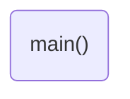

# Program: BusOut Cylon
**Author:**   
**Date:** 

**Modified by:**  
**Date:**

**Purpose:** 

## Configuration
Designed for bare metal Mbed OS 6 (enabled through `mbed_app.json`).

## Hardware
### Internal
* BusOut to four internal LEDs (LED1, LED2, LED3, LED4)
## Flow
