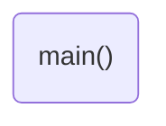

# Program: Button Selector
**Author:**   
**Date:** 

**Modified by:**  
**Date:**

**Purpose:** 

## Configuration
Designed for bare metal Mbed OS 6 (enabled through `mbed_app.json`).

## Hardware
### External
* p5 (DigitalOut) --> ?? complete this ??
* p6 (DigitalOut) --> ?? complete this ??
* p7 (DigitalIn) <-- ?? complete this ??

## Flow

